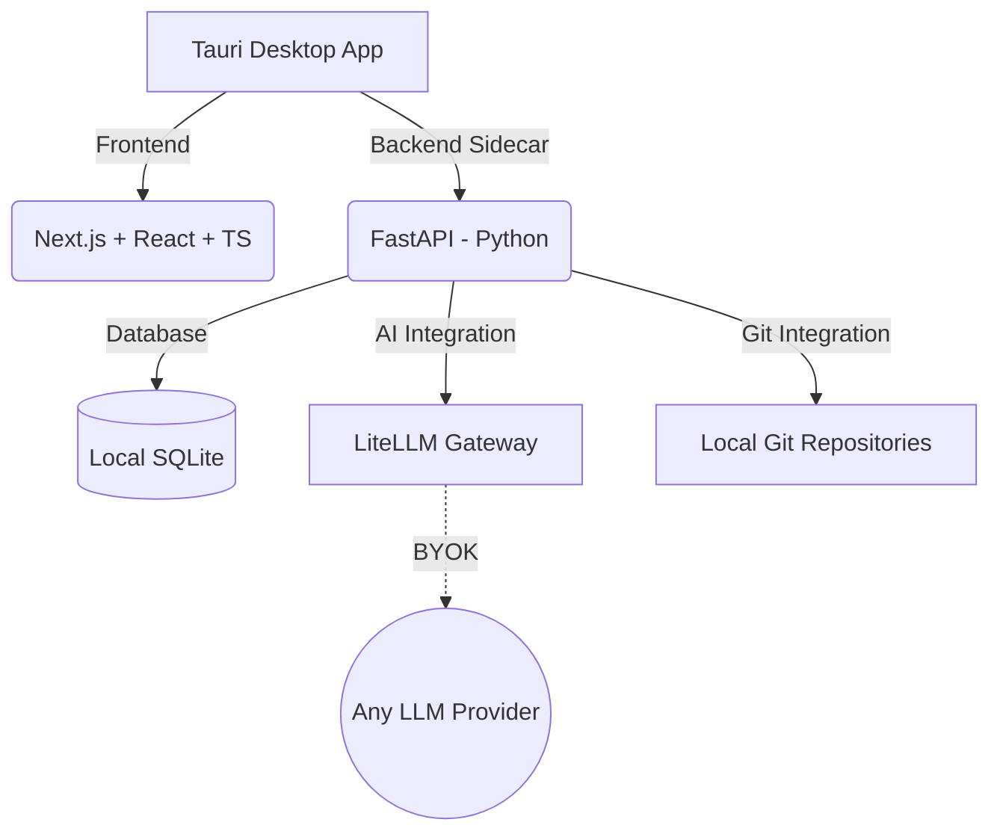

# SprintLogic 🚀


SprintLogic is an open-source, **Local-First Desktop Application** built specifically for solo developers. It acts as a comprehensive command center that optimizes your development workflow through deep local repository integration, AI-driven automation (SprintLogic AI) based on the SDD/TDD lifecycle, and rigorous Git control.

## 🌟 Key Features

- **Native SDD & TDD**: SprintLogic AI helps structure your design (Proposal, Specs, Design, Tasks) before you write any code, and accompanies you in writing tests.
- **Git Perfection**: Frictionless control and suggestions for branch names and atomic commits. Everything is directly linked to Kanban board tasks.
- **Absolute Local Privacy**: Zero multi-tenancy. Zero cloud databases. All project and workflow information resides in a local SQLite database, and the AI API key (BYOK) is stored exclusively on your machine.
- **Codebase Memory Graph**: Maps local code using `tree-sitter`, stores nodes/edges in SQLite, and renders them in 2D.
- **Persistent AI Memory**: Long-term memory for SprintLogic AI (Engram). Automatically saves architectural decisions and session summaries at the end of your work blocks.
- **Dependency-Aware RAG**: AST Parser reads `package.json` or `pyproject.toml` to identify libraries and retrieves updated snippets to prevent AI hallucinations.

## 🏗 Architecture

The platform is designed as a secure, fast, and local Desktop Wrapper:



- **Desktop Wrapper**: [Tauri](https://tauri.app/) (Linux First).
- **Frontend**: Next.js + React + TypeScript + TailwindCSS.
- **Backend / Core**: FastAPI (Python) running as a local sidecar executable.
- **Database**: Embebbed SQLite (`sqlite-vec` for semantic search).

## 🚀 Getting Started

### Prerequisites
- Node.js (v18+)
- Python (3.10+)
- Rust (required by Tauri)

### Installation

1. **Clone the repository:**
   ```bash
   git clone https://github.com/carlosindriago/SprintLogic.git
   cd SprintLogic
   ```

2. **Run the development environment:**
   We use a monorepo structure. Run the provided script to start the stack:
   ```bash
   ./start_dev.sh
   ```

3. **Configure your AI API Key:**
   On the first launch, the application will prompt you to enter your preferred LLM API key. This key is encrypted and stored locally.

## 🤝 Contributing

We welcome contributions from the community! Please read our [Contributing Guide](CONTRIBUTING.md) to learn about our development process, how to propose bugfixes and improvements, and how to build and test your changes.

By participating in this project, you agree to abide by our [Code of Conduct](CODE_OF_CONDUCT.md).

## 📜 License

This project is licensed under the MIT License - see the [LICENSE](LICENSE) file for details.

## 📚 Documentation

For more detailed technical documentation, please refer to the `docs/` folder:
- [Project Blueprint](docs/PROJECT_BLUEPRINT.md)
- [Architecture](docs/ARCHITECTURE.md)
- [Development Rules](docs/DEVELOPMENT_RULES.md)
- [Git Workflow](docs/GIT_WORKFLOW.md)
- [Roadmap](docs/ROADMAP.md)
