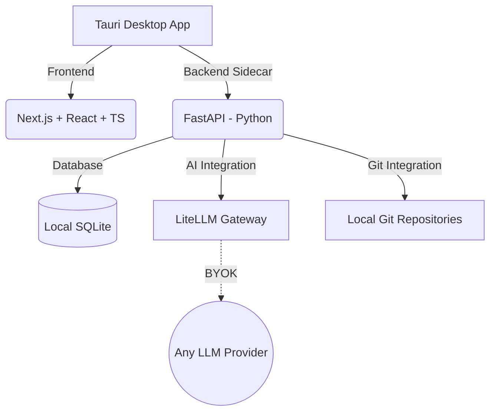

# SprintLogic 🚀


SprintLogic is an open-source, **Local-First Desktop Application** built specifically for solo developers. It acts as a comprehensive command center that optimizes your development workflow through deep local repository integration, AI-driven automation (SprintLogic AI) based on the SDD/TDD lifecycle, and rigorous Git control.

## 🌟 Key Features

- **Absolute Local Privacy**: Zero multi-tenancy. Zero cloud databases. All project and workflow information resides in a local SQLite database, and the AI API keys (BYOK) are stored securely and exclusively on your local machine.
- **SprintLogic AI**: Advanced AI assistance utilizing models from Google Gemini, OpenAI, Anthropic, OpenRouter, and more. 
- **Native SDD & TDD**: SprintLogic AI helps structure your design (Proposal, Specs, Design, Tasks) before you write any code, and accompanies you in writing tests.
- **Vim-Powered Editor**: High-performance Monaco Editor built in, featuring robust Vim mode, persistent sessions, and an interactive **VimTutorHUD** to help you master keyboard-centric navigation and shortcuts.
- **Dependency-Aware RAG & Context7**: Deep integration with real-time official documentation. The Context7 MCP provides access to the latest docs for React, Next.js, Python, Tailwind, etc., preventing AI hallucinations.
- **Git Perfection**: Frictionless control over your version history. Offers suggestions for branch names, atomic commits, and direct Kanban board synchronization.
- **Codebase Memory Graph**: Maps local code using `tree-sitter`, stores nodes and edges in SQLite, and renders them in an interactive 2D graph.
- **Persistent AI Memory**: Long-term AI memory that automatically saves architectural decisions, conventions, and session summaries at the end of your work blocks.

---

## 🏗 Architecture

SprintLogic is designed as a secure, fast, and local Desktop Wrapper. It follows a monorepo structure:



- **Desktop Wrapper**: [Tauri](https://tauri.app/) (Linux First, Windows/macOS support coming).
- **Frontend**: Next.js + React + TypeScript + TailwindCSS.
- **Backend / Core**: FastAPI (Python) running as a local sidecar executable.
- **Database**: Embedded SQLite (`sqlite-vec` for semantic search).

---

## 🚀 Getting Started

### Prerequisites

Ensure your system meets the following requirements:
- **Node.js**: v18 or higher
- **Python**: v3.10 or higher (we recommend using [uv](https://github.com/astral-sh/uv) for fast package management)
- **Rust**: Required by Tauri for building the desktop app.

### Installation

1. **Clone the repository:**
   ```bash
   git clone https://github.com/carlosindriago/SprintLogic.git
   cd SprintLogic
   ```

2. **Run the development environment:**
   SprintLogic is a monorepo containing both the Next.js frontend and FastAPI backend. We provide an automated bootstrap script to install dependencies and run both servers concurrently:
   ```bash
   ./start_dev.sh
   ```
   *This script automatically sets up the Python virtual environment via `uv`, installs frontend Node packages, starts the FastAPI backend (port 8000), and launches the Tauri Desktop App.*

3. **Configure your AI API Key:**
   On your first launch, go to the **LLM Settings Panel** in the app. Enter your preferred API key (Gemini, OpenAI, Anthropic, etc.). You can also configure the **Context7** API Key for enhanced documentation retrieval. All keys are encrypted and stored locally on your device.

---

## 🛠️ Usage & Modes

SprintLogic offers several interconnected tools designed to accelerate a developer's iteration speed:

### 1. Editor Mode & FIM Tutor
The embedded Monaco Editor is the heart of SprintLogic's coding experience. 
- **FIM (Fill-In-The-Middle)**: AI-driven autocomplete intelligently finishes your code blocks and functions in real-time. Toggle it on/off directly from the editor toolbar (✨ icon).
- **Vim Mode & Tutor HUD**: Power users can toggle **Vim Mode** to use standard Vim keybindings (`hjkl`, `dd`, `ciw`, etc.). If you're learning Vim, the **VimTutorHUD** provides contextual hints and shortcut tips dynamically at the bottom of the editor.

### 2. Sensei Mode (Chat Assistant)
Click the 🎓 (Graduation Cap) icon to interact with the **SprintLogic Sensei**. 
- Ask architectural questions, request code refactors, or get help debugging.
- The Sensei has access to your **Codebase Graph** and uses **Context7** to fetch the exact, up-to-date documentation needed to assist you.

### 3. Git Graph & Kanban Sync
SprintLogic maps your workflow to a structured Kanban process:
- Switch to the **Git Graph Tab** to visualize your local repository branches.
- Link branches directly to Kanban issues.
- The AI will automatically analyze your uncommitted changes and propose atomic, semantic **Conventional Commits** to keep your git history pristine.

### 4. SDD (Spec-Driven Development) Pipeline
When undertaking large features, utilize the built-in SDD tools:
- Allow SprintLogic AI to generate **Implementation Plans**, **Specs**, and **Walkthroughs** before writing code.
- SprintLogic's persistent memory will index these decisions and recall them in future sessions.

---

## 🤝 Contributing

We welcome contributions from the community! Please read our [Contributing Guide](CONTRIBUTING.md) to learn about our development process, how to propose bugfixes and improvements, and how to build and test your changes.

By participating in this project, you agree to abide by our [Code of Conduct](CODE_OF_CONDUCT.md).

## 📜 License

This project is licensed under the MIT License - see the [LICENSE](LICENSE) file for details.

## 📚 Documentation

For more detailed technical documentation, please refer to the `docs/` folder:
- [Project Blueprint](docs/PROJECT_BLUEPRINT.md)
- [Architecture](docs/ARCHITECTURE.md)
- [Development Rules](docs/DEVELOPMENT_RULES.md)
- [Git Workflow](docs/GIT_WORKFLOW.md)
- [Roadmap](docs/ROADMAP.md)
